# Job Agent

AI-powered job search assistant that scrapes job descriptions, tailors resumes via LLM, and outputs ATS-friendly single-page PDFs.

## Pipeline

```mermaid
flowchart TB

%% =========================
%% 1. JOB ACQUISITION
%% =========================
subgraph ACQ["1. Job Acquisition"]
    direction TB

    AF["Auto Fetch<br/>(jobs.py)"]
    MI["Manual Input<br/>(manual_input.py)"]
    RL["Role Synonyms<br/>(role_synonyms.yml)"]
    JL["Normalized Job List<br/>title • company • url • description"]

    AF --> RL
    MI --> RL

    AF -.->|"Greenhouse / Lever / Ashby"| JL
    MI -.->|"Paste URL or Type"| JL

    RL --> JL
end

%% =========================
%% 2. FILTERING
%% =========================
subgraph FILT["2. Filtering"]
    direction TB

    DEDUP{"Already Applied?"}
    JDOK{"JD Available?"}
    SENIOR{"Senior Role<br/>or ≥ 3 YOE?"}
    SCORE["LLM Job Score<br/>(1–10)"]

    SCRAPE["Scrape Missing JD<br/>(basic_scrape_jd.py)"]

    SKIP1["Skip"]
    SKIP2["Skip"]
    SKIP3["Skip"]

    PROCEED["Proceed"]

    JL --> DEDUP

    DEDUP -->|Yes| SKIP1
    DEDUP -->|No| JDOK

    JDOK -->|No| SCRAPE
    SCRAPE --> SENIOR

    JDOK -->|Yes| SENIOR

    SENIOR -->|Yes| SKIP2
    SENIOR -->|No| SCORE

    SCORE -->|"Score < 6"| SKIP3
    SCORE -->|"Score ≥ 6"| PROCEED
end

%% =========================
%% 3. RESUME TAILORING
%% =========================
subgraph TAIL["3. Resume Tailoring"]
    direction TB

    KW["Keyword Extraction<br/>(jd_processing.py)"]

    SUM["Tailored Summary<br/>(LLM.tailor_summary)"]

    EXP["Experience Selection<br/><br/>
    • High priority → include all bullets<br/>
    • Low priority → top 2–3 bullets<br/>
    • MIN_EXPERIENCES = 3"]

    PRJ["Project Selection<br/><br/>
    • Rank by tags + priority<br/>
    • Select top 2<br/>
    • Fill until MIN_PROJECTS"]

    RENDER["Render Resume<br/>(Jinja2 HTML Template)"]

    PDF["Generate PDF<br/>(Playwright)<br/><br/>
    output/resume_company_date.pdf"]

    PROCEED --> KW
    KW --> SUM
    SUM --> EXP
    EXP --> PRJ
    PRJ --> RENDER
    RENDER --> PDF
end

%% =========================
%% 4. APPLICATION
%% =========================
subgraph APPLY["4. Application"]
    direction TB

    CL["Generate Application Assets<br/><br/>
    • Cover Letter<br/>
    • Fit Reason<br/>
    • Custom Responses"]

    SAVE["Save Application<br/>(jobs.json)<br/>dedupe by URL"]

    OPEN["Open Browser<br/>Mark as Applied"]

    PDF --> CL
    CL --> SAVE
    SAVE --> OPEN
end

%% =========================
%% STYLES
%% =========================
classDef skip fill:#ffe5e5,stroke:#cc0000,color:#660000;
classDef process fill:#eaf3ff,stroke:#4a90e2,color:#123;
classDef decision fill:#fff7d6,stroke:#c9a400,color:#333;

class SKIP1,SKIP2,SKIP3 skip;
class AF,MI,RL,JL,SCRAPE,SCORE,PROCEED,KW,SUM,EXP,PRJ,RENDER,PDF,CL,SAVE,OPEN process;
class DEDUP,JDOK,SENIOR decision;
```



## Research Report

`research_report.md` is an empirical case study of this pipeline: scoring
validity, content personalization, and keyword-extractor quality, measured on
the real application log (`jobs.json`) and a clearly-labeled synthetic corpus
(`data/synthetic_jds.json`). Reproduce all figures and stats with:

```bash
pip install -r requirements.txt
python analysis/analyze.py                     # real-data stats + charts
python analysis/generate_synthetic_corpus.py 150 42
python analysis/synthetic_benchmark.py         # synthetic benchmark
```

## Setup

```bash
pip install -r requirements.txt
playwright install chromium
cp .env.example .env   # fill in OPENAI_API_KEY
```

Prepare your data in `resume_store.yaml` (see `resume_store.example.yaml` for structure).

## Usage

```bash
python main.py
```

Choose mode:
- **1 — Auto fetch**: enters a role (e.g. "software engineer"), searches Greenhouse/Lever/Ashby boards, filters and scores jobs
- **2 — Manual input**: paste a URL (auto-scraped) or type job details

## File Map

| File | Role |
|---|---|
| `main.py` | CLI entry point, orchestrates fetch → filter → build → apply |
| `jobs.py` | ATS fetchers (Greenhouse, Lever, Ashby) + role synonym expansion |
| `resume_builder.py` | Core pipeline: keyword match → AI tailoring → template → PDF |
| `resume_models.py` | Pydantic schemas for the YAML store |
| `llm.py` | LLM wrapper: scoring, summary tailoring, bullet reordering, cover letters |
| `storage.py` | JSON persistence with URL-based dedup |
| `manual_input.py` | URL scrape + multi-line description paste (Ctrl+D) |
| `scraping/jd_processing.py` | Keyword extraction, tag-based scoring, YOE regex |
| `scraping/utils.py` | `is_senior_role()` LLM check |
| `scraping/basic_scrape_jd.py` | BS4-based JD scraper |
| `templates/resume_template.html` | Jinja2 resume template (850×1100px fixed) |
| `role_synonyms.yml` | Role → title synonyms for query expansion |
| `resume_store.yaml` | Structured resume data (gitignored) |
| `jobs.json` | Application tracker (gitignored) |
| `output/` | Generated HTML + PDFs (gitignored) |

## Constraints

- Always single page: `width:850px; height:1100px; overflow:hidden`
- At least 3 work experiences, min 1 bullet each
- Projects capped at `min(3, len(store.projects))`
- High-priority jobs always included with all bullets
- Internships only included if tag-relevant

## Cost

~4 LLM calls per resume (~750 tokens total):
1. Summary tailoring
2. Bullet reordering (per experience/project)
3. Job scoring
4. Cover letter generation

Tag matching is free (no LLM).
