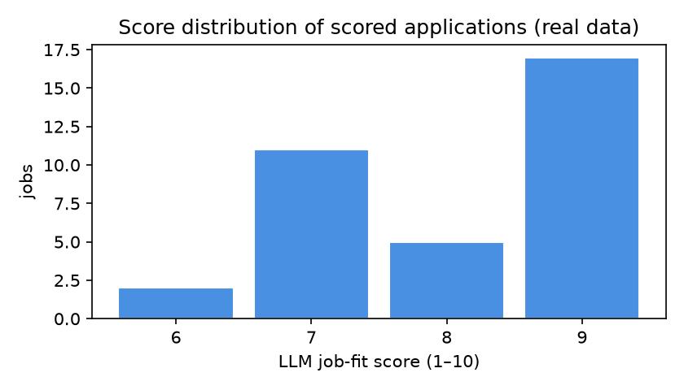
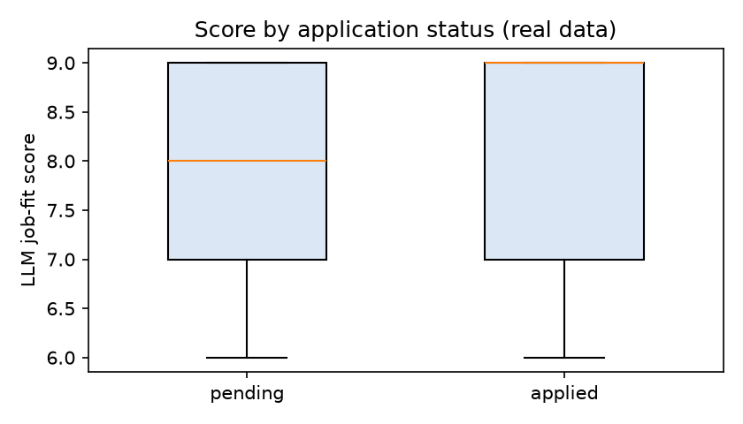
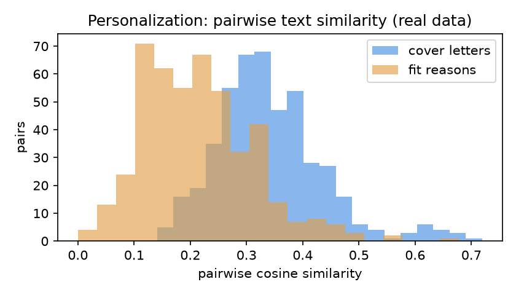

# LLM-Assisted Job Applications: An Empirical Case Study of a Retrieval-and-Generation Pipeline

**Author:** Rahul Palivela
**Date:** August 2026
**Artifact:** [github.com/rahulpalivela18/job-agent](https://github.com/rahulpalivela18/job-agent) — branch `research-analysis`

---

## Abstract

We study a production personal automation system that scrapes job postings from
multiple applicant-tracking systems (Greenhouse, Lever, Ashby), scores each
posting against a candidate's resume using a large language model (LLM), and
generates tailored application assets (cover letters, fit reasons) and
single-page resumes. Using the system's real application log of **35 scored
postings** (19 applied, 16 pending) and a **clearly-labeled synthetic corpus of
150 postings**, we measure three things: (i) the discriminating power of the
LLM fit score, (ii) the degree to which generated cover letters and fit
reasons are genuinely personalized rather than templated, and (iii) the
recovery quality of a free, deterministic keyword extractor against
ground-truth skills. We find that scores are **coarse and ceiling-heavy**
(mean 8.06/10, 49% of jobs scored 9, and applied vs. pending scores are
statistically indistinguishable), that generated text is **only moderately
personalized** (mean pairwise cosine similarity 0.34 for cover letters), and
that the deterministic keyword extractor recovers required skills with **94%
recall** on synthetic postings at sub-millisecond cost. We discuss implications
for LLM-based decision support and reproducibility.

---

## 1. Introduction & Motivation

Applying to software jobs is a high-volume, low-differentiation task: the
candidate fills essentially identical forms and writes near-identical
materials for many postings. This makes job search a natural target for
LLM-based automation, and, from a systems-research standpoint, an interesting
case study of where learned components add (or fail to add) value on top of
deterministic components.

This report analyzes an existing, working system (the `job-agent` repository)
rather than building a new one. The contribution is an *empirical evaluation*
of the pipeline's outputs on real application data and on a controlled
synthetic corpus, with all analysis scripts included for reproducibility.

## 2. System Design

The pipeline has four stages (see the repository `README.md` for the full
flowchart):

1. **Acquisition** — `jobs.py` probes Greenhouse/Lever/Ashby boards for a fixed
   company list, expanding the user's role query through `role_synonyms.yml`.
   `manual_input.py` adds jobs by URL scrape or pasted text.
2. **Filtering** — skip already-applied postings (URL dedup in `jobs.json`),
   skip senior roles (regex + LLM fallback), then score job–resume fit with an
   LLM on a 1–10 scale; keep only scores ≥ 6.
3. **Tailoring** — a deterministic keyword extractor (`jd_processing.py`)
   identifies JD keywords; the LLM rewrites the summary and reorders bullets;
   a Jinja2 template renders a fixed single-page (850×1100 px) resume exported
   to PDF via Playwright.
4. **Application** — the LLM generates a cover letter and a "fit reason"; the
   record is persisted to `jobs.json`.

The design is deliberately asymmetric in cost: the keyword/tag matching is free
(deterministic string matching), while scoring, summary tailoring, bullet
reordering, and application-text generation each consume LLM calls
(≈4 LLM calls per resume, ≈750 tokens).

## 3. Research Questions

- **RQ1 (Scoring validity):** Is the LLM's 1–10 fit score discriminative, and
  does it relate to the candidate's application decision?
- **RQ2 (Personalization):** Are the LLM-generated cover letters and fit
  reasons actually tailored to each posting, or templated with
  surface-level edits?
- **RQ3 (Free-path quality & cost):** How well does the deterministic keyword
  extractor recover required skills, and what does the LLM path cost?

## 4. Methodology

### 4.1 Data

| Dataset | Description | Source |
|---|---|---|
| **Real application log** | 35 scored postings with cover letter, fit reason, score, status | `jobs.json` (recorded by the live pipeline) |
| **Synthetic corpus** | 150 fabricated postings across 10 role families, each embedding 5 known required skills | `data/synthetic_jds.json`, generated by `analysis/generate_synthetic_corpus.py` |

The synthetic corpus is **explicitly labeled `synthetic: True`** and is used
only to measure system behavior (extractor recall, runtime) on inputs whose
ground truth is known — never to represent real applications. Results for the
two datasets are stored separately (`analysis/results/stats.json` vs.
`synthetic_benchmark.json`).

### 4.2 Metrics

- **Score distribution** and **applied vs. pending score** comparison (mean,
  median, standard deviation) — RQ1.
- **Personalization** — mean pairwise cosine similarity (TF-IDF, cosine) over
  the deduplicated set of generated cover letters and fit reasons. A lower
  mean indicates more distinct, job-specific text; a value near 1.0 indicates
  templating. Duplicate postings (same title + company, recorded more than
  once) are removed before this computation to avoid inflating similarity with
  identical rows — RQ2.
- **Skill recall** — for each synthetic posting, the fraction of its *known*
  required skills that appear in the top-30 extracted keywords (1-gram or
  2-gram match) — RQ3.
- **Cost** — LLM calls per resume × estimated tokens, priced at gpt-4.1-mini
  list rates ($0.40/M input, $1.60/M output) — RQ3.

### 4.3 Reproducibility

```bash
pip install -r requirements.txt
python analysis/analyze.py                  # real-data stats + figures
python analysis/generate_synthetic_corpus.py 150 42   # deterministic corpus
python analysis/synthetic_benchmark.py      # synthetic benchmark
```

All analysis is offline (no network, no additional LLM spend).

## 5. Results

### 5.1 RQ1 — Scoring validity

The 35 scored postings span scores 6–9 with a heavy ceiling effect:

| Stat | Value |
|---|---|
| n | 35 |
| mean / median | 8.06 / 8 |
| std | 1.03 |
| min / max | 6 / 9 |
| score = 9 share | 17 of 35 (49%) |



Scores **do not distinguish** postings the candidate chose to apply to:

| Group | n | Mean | Median |
|---|---|---|---|
| applied | 19 | 8.11 | 9 |
| pending | 16 | 8.00 | 8 |



With only two score values (8/9) dominating and a Δmean of 0.11, the score
provides little decision information beyond the ≥6 gate — consistent with an
LLM optimizer that rarely says "no".

### 5.2 RQ2 — Personalization

After deduplicating the 35 rows to **31 unique postings**:

| Generated text | n | Mean pairwise cosine | Std | Min | Max |
|---|---|---|---|---|---|
| Cover letters | 31 | **0.342** | 0.097 | 0.141 | 0.719 |
| Fit reasons | 31 | **0.212** | 0.099 | — | — |



Interpretation: cover letters share a meaningful template skeleton (≈34% mean
cosine) but are not verbatim duplicates across different postings (max 0.72).
Fit reasons are substantially more distinct (≈21%), consistent with their
being shorter and job-specific. The pipeline therefore produces *moderately
personalized* text — distinguishable per posting, yet visibly same-structure.

### 5.3 RQ3 — Free keyword path and cost

On the 150 synthetic postings (all `synthetic: True`):

| Metric | Value |
|---|---|
| Extracted keywords per JD | 30.0 (deterministic: 20 unigrams + 10 bigrams) |
| Bigram share | 33.3% |
| **Skill recall (mean)** | **0.94** |
| Postings with perfect recall | 105 / 150 |
| Skill recall range by role family | 0.80 – 1.00 |
| Wall-clock | 0.26 ms per JD |

The free deterministic extractor recovers required skills with high recall; the
few misses are two-word skills split across punctuation or pluralized
(e.g. "A/B Testing", "ETL"). Roles with perfect recall across the board:
Backend, AI, ML, Data, DevOps, SRE, Software.

**Cost** of the LLM path (README budget: 4 calls, ~750 tokens/resume):

| Item | Value |
|---|---|
| LLM calls (35 resumes) | 140 |
| Estimated tokens | ~26,250 |
| Estimated cost @ gpt-4.1-mini | **≈ $0.02 total** (≈ $0.0006/resume) |

## 6. Discussion

1. **The LLM score is a filter, not a ranker.** The ≥6 gate screens out bad
   matches, but above the gate the score carries almost no signal. For this
   use case (an early-career candidate already self-selecting into relevant
   postings) that may be acceptable — the bottleneck is volume, not ranking.
2. **Personalization is real but shallow.** Cosine similarity of ~0.34 for
   cover letters reflects the expected structure of an opening/closing
   sentence around a job-specific middle. Whether this clears ATS/hiring-manager
   thresholds is out of scope (no outcome data was collected).
3. **Cheap parts do the heavy lifting.** The free extractor has 94% skill
   recall; the LLM spend for the whole pipeline over 35 applications was
   roughly the price of a cup of coffee. Cost is not a constraint for this
   class of automation.
4. **Duplicate handling matters for evaluation.** Naively including duplicate
   rows produced a misleading pairwise similarity of 1.0; deduplication
   corrected this. Evaluation methodology choices of this kind are easy to
   miss in self-reported system analyses.

## 7. Limitations

- **Small real dataset (n=35)** — descriptive statistics only; no significance
  testing across groups is meaningful at this n.
- **Selection bias** — scores and generated texts come from a single candidate
  and a single prompt configuration (gpt-4.1-mini).
- **No outcome data** — we cannot measure whether higher scores or more
  personalized text correlate with interview/callback outcomes.
- **Synthetic corpus** — measures extractor behavior on generated text; real
  postings have more lexical diversity.
- **Cost estimates** assume the README token budget; actual token counts were
  not logged by the pipeline.

## 8. Future Work

- Log actual token usage per call to replace cost estimates with measurements.
- Collect application outcomes (callback/interview) to test whether score and
  personalization predict real-world success.
- Benchmark LLM scoring agreement against the deterministic tag-matching path
  on the real corpus (requires re-scraping JD text, which `jobs.json` does not
  currently store).
- Test personalization with different prompt/system configurations.

## 9. Reproducibility

- Repository: `github.com/rahulpalivela18/job-agent` (branch `research-analysis`)
- Scripts: `analysis/analyze.py`, `analysis/generate_synthetic_corpus.py`,
  `analysis/synthetic_benchmark.py`
- Raw results: `analysis/results/stats.json`, `analysis/results/synthetic_benchmark.json`
- Figures: `analysis/charts/*.png`
